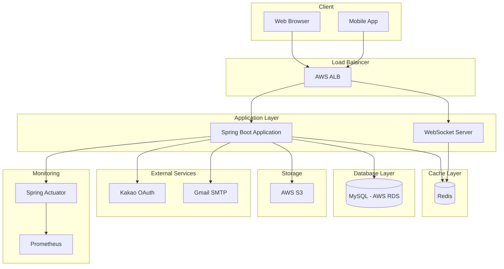
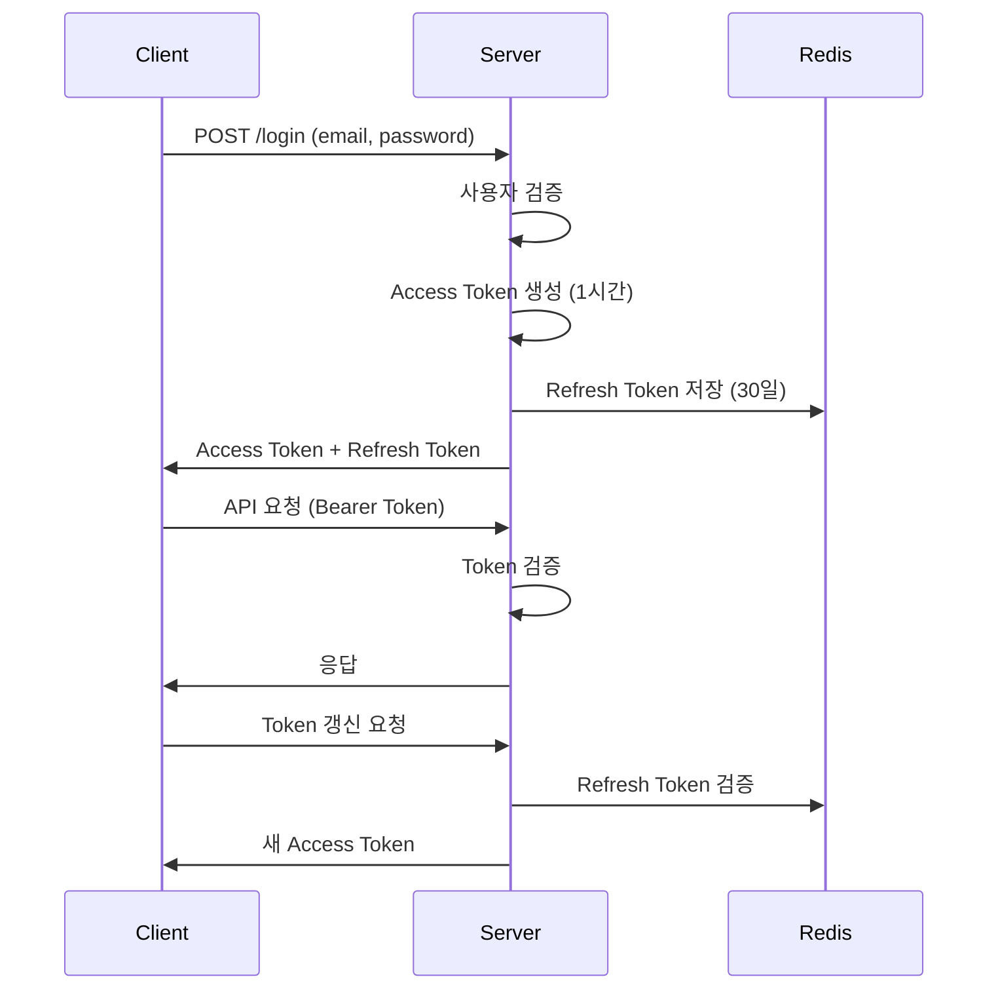
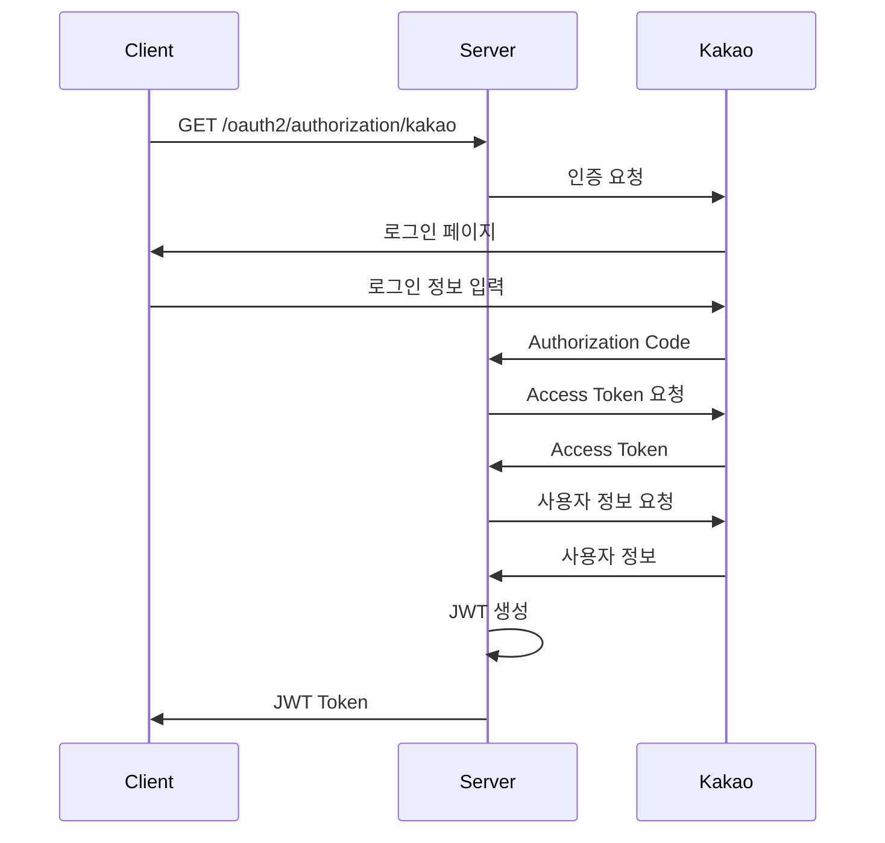
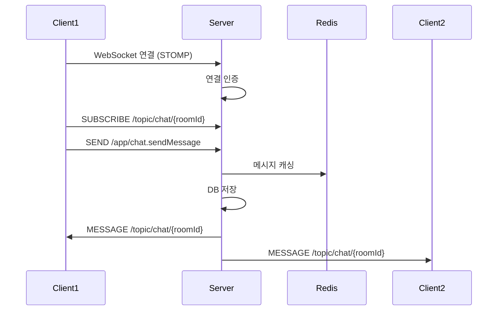
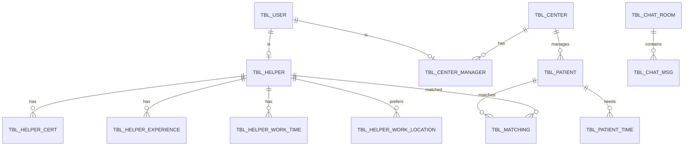

# 시스템 아키텍처

## 개요

돌봄(Dolbom)은 요양보호사와 환자를 매칭하는 플랫폼으로, Spring Boot 기반의 모놀리식 아키텍처로 구성되어 있습니다.

---

## 시스템 구성도



---

## 디렉토리 구조

```
src/main/java/com/balybus/galaxy/
├── home/                          # 홈 화면
├── login/                         # 로그인 기능
│   ├── classic/                   # 일반 로그인 (이메일/비밀번호)
│   └── oauth/                     # OAuth2 로그인 (Kakao)
├── member/                        # 회원 관리
├── signUp/                        # 회원가입
├── careAssistant/                 # 요양보호사 관련
│   ├── controller/
│   ├── domain/                    # TblHelper, TblHelperCert 등
│   ├── service/
│   ├── dto/
│   └── repository/
├── patient/                       # 환자 관련
│   ├── basic/                     # 환자 기본 정보
│   ├── recruit/                   # 요양보호사 모집
│   └── matchingStatus/            # 매칭 상태
├── centerManager/                 # 센터 관리자
├── chat/                          # 실시간 채팅
│   ├── controller/
│   ├── service/
│   └── dto/
└── global/                        # 공통 기능
    ├── domain/                    # 도메인 엔터티들
    ├── config/                    # Spring 설정
    │   ├── aop/                   # AOP 설정
    │   ├── jwt/                   # JWT 및 Redis 설정
    │   └── webSocket/             # WebSocket 설정
    ├── common/                    # 공통 컨트롤러
    ├── exception/                 # 예외 처리
    └── utils/                     # 유틸리티
        ├── address/               # 주소 검색/조회
        ├── file/                  # 파일 처리
        ├── mail/                  # 이메일 발송
        └── code/                  # 코드성 데이터
```

---

## 주요 도메인

### 1. 요양보호사 (Care Assistant / Helper)

요양보호사의 프로필, 경력, 자격증, 근무 조건을 관리합니다.

| 엔터티 | 설명 |
|--------|------|
| `TblHelper` | 요양보호사 기본 정보 |
| `TblHelperCert` | 보유 자격증 정보 |
| `TblHelperExperience` | 경력 상세 정보 |
| `TblHelperWorkTime` | 근무 가능 시간 |
| `TblHelperWorkLocation` | 근무 희망 지역 |

### 2. 환자 (Patient)

돌봄이 필요한 환자의 정보와 요구사항을 관리합니다.

| 엔터티 | 설명 |
|--------|------|
| `TblPatient` | 환자 기본 정보 |
| `TblPatientTime` | 필요한 근무 시간 |
| `TblPatientLog` | 환자 정보 변경 이력 |
| `TblPatientTimeLog` | 근무 시간 변경 이력 |

### 3. 매칭 (Matching)

요양보호사와 환자 간의 매칭을 관리합니다.

| 엔터티 | 설명 |
|--------|------|
| `TblMatching` | 매칭 정보 및 상태 |

### 4. 채팅 (Chat)

실시간 채팅 기능을 제공합니다.

| 엔터티 | 설명 |
|--------|------|
| `TblChatRoom` | 채팅방 정보 |
| `TblChatMsg` | 채팅 메시지 |

### 5. 센터 (Center)

요양 센터와 관리자 정보를 관리합니다.

| 엔터티 | 설명 |
|--------|------|
| `TblCenter` | 요양 센터 정보 |
| `TblCenterManager` | 센터 관리자 정보 |

### 6. 공통 (Common)

| 엔터티 | 설명 |
|--------|------|
| `TblUser` | 사용자 계정 정보 |
| `TblAddressFirst/Second/Third` | 계층적 주소 (시도/시군구/읍면동) |
| `TblCare` | 요양 케어 종류 |
| `TblImg` | 이미지 정보 |
| `TblAuthenticationMail` | 이메일 인증 정보 |

---

## 인증 흐름

### JWT 인증



### OAuth2 (Kakao) 인증



---

## 실시간 채팅 아키텍처



---

## 외부 서비스 연동

| 서비스 | 용도 | 설정 파일 |
|--------|------|-----------|
| AWS RDS (MySQL) | 메인 데이터베이스 | `application-db.yml` |
| AWS S3 | 파일 스토리지 (프로필 사진, 증명서) | `application-aws.yml` |
| AWS Lambda | 서버리스 함수 | `application-aws.yml` |
| Redis | 세션 관리, 토큰 저장, 메시지 캐싱 | `application-db.yml` |
| Kakao OAuth | 소셜 로그인 | `application-oauth.yml` |
| Gmail SMTP | 이메일 인증, 알림 발송 | `application-mail.yml` |

---

## 데이터베이스 설계

### ERD

전체 ERD는 [ERDCloud](https://www.erdcloud.com/d/Ps5YSRwrTa7Jfwgk4)에서 확인할 수 있습니다.

### 주요 테이블 관계



---

## 환경 설정 파일

| 파일 | 용도 |
|------|------|
| `application.yml` | 메인 설정 (프로필 활성화) |
| `application-db.yml` | 데이터베이스 설정 (MySQL, Redis) |
| `application-jwt.yml` | JWT 토큰 설정 |
| `application-oauth.yml` | OAuth2 설정 (Kakao) |
| `application-mail.yml` | 이메일 발송 설정 |
| `application-aws.yml` | AWS 서비스 설정 |

---

## API 컨트롤러 목록

| 컨트롤러 | 경로 | 주요 기능 |
|---------|------|---------|
| `HomeController` | `/` | 홈 화면 |
| `LoginController` | `/login` | 일반 로그인 |
| `UserController` | `/user` | OAuth2 사용자 관리 |
| `SignUpController` | `/signup` | 회원가입 |
| `HelperController` | `/helper` | 요양보호사 프로필 |
| `BasicController` | `/patient/basic` | 환자 기본 정보 |
| `RecruitController` | `/patient/recruit` | 요양보호사 모집 |
| `MatchingStatusController` | `/patient/matching` | 매칭 상태 |
| `CmController` | `/centerManager` | 센터 관리자 |
| `ChatController` | `/chat` | 채팅 메시지 |
| `ChatSocketController` | `/ws` | WebSocket 채팅 |
| `AddressController` | `/address` | 주소 조회 |
| `CommonController` | `/common` | 공통 기능 |
